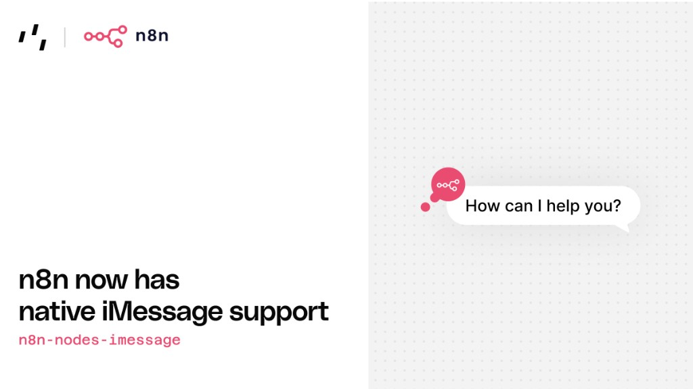

# n8n-nodes-imessage

[](https://www.npmjs.com/package/n8n-nodes-imessage)
[](https://opensource.org/licenses/MIT)

<p align="center">
  
</p>

Send and receive iMessages from n8n workflows — powered by [Photon Spectrum](https://docs.photon.codes/spectrum-ts/providers/imessage).

## Install

```bash
npm install n8n-nodes-imessage
```

See the [n8n community nodes guide](https://docs.n8n.io/integrations/community-nodes/installation/) for self-hosted setup.

## Credentials

In n8n, create a **Photon iMessage API** credential with your **Project ID** and **API Key** from [app.photon.codes](https://app.photon.codes) → your project → **Settings**.

## Nodes

### iMessage by Photon

Send iMessages from a workflow.

**Default actions:** Send Message, Send Attachment, Reply, React, Typing Indicator.

Turn on **Show Expert Options** for rich links, voice notes, polls, effects, group albums, and more.

**Quick start:** Manual Trigger → Send Message → phone number (+15551234567) + text. Apple ID emails are not supported — use a phone number.

**Auto-reply:** On iMessage Event → Reply or React (sender and message ID come from the trigger).

### iMessage by Photon Trigger

Runs when an inbound text message arrives. Output includes `messageId`, `sender`, `text`, `linePhone`, `spaceId`, `spaceType`, and `timestamp`.

Activate the workflow to register the webhook. For local development:

```bash
npm run dev:tunnel
```

## Local development

```bash
npm install
npm run dev:tunnel
```

## Docs

- [Spectrum iMessage provider](https://docs.photon.codes/spectrum-ts/providers/imessage)
- [Webhook events](https://docs.photon.codes/webhooks/events)
- [iMessage deliverability](https://docs.photon.codes/best-practices/imessage-deliverability)

## License

[MIT](LICENSE)
